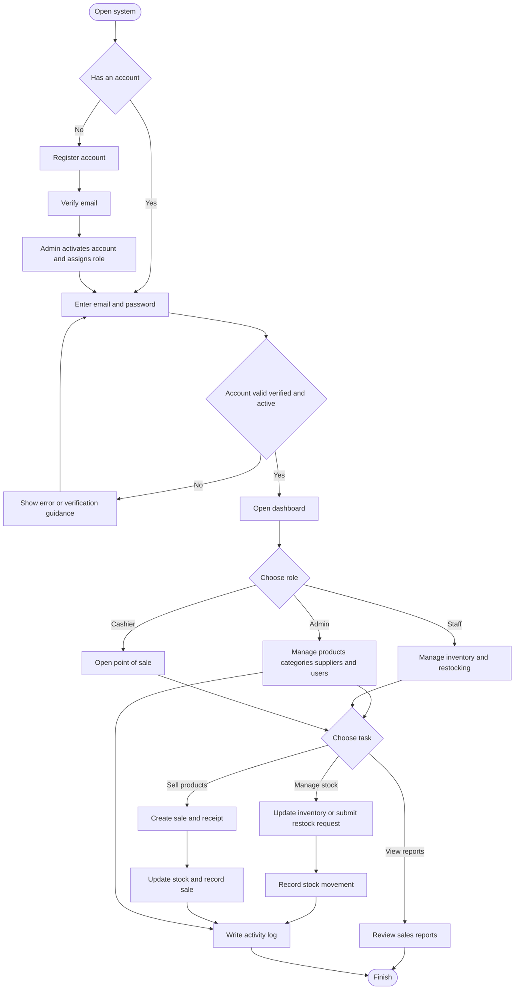
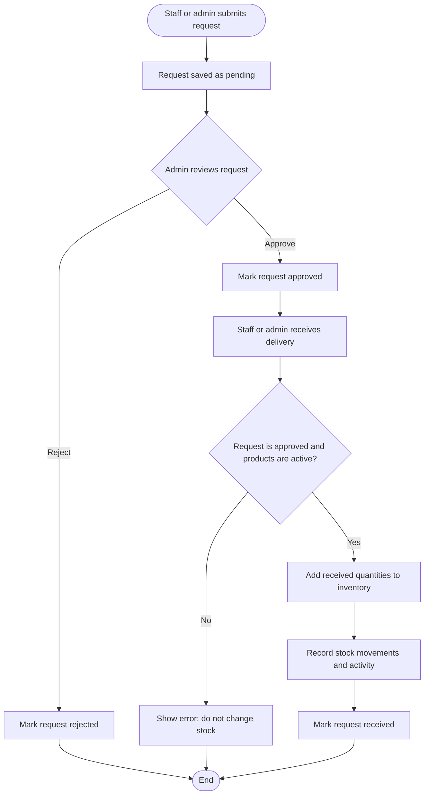
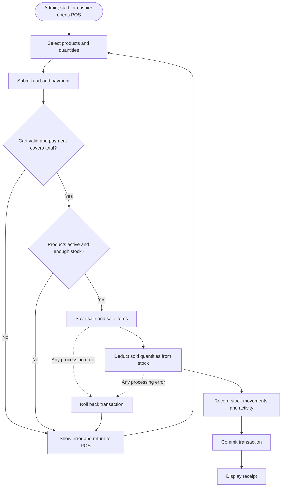
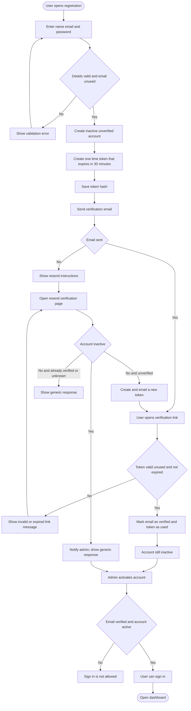

# AC Store Management System Flowchart

## Main system flow

```mermaid
graph TD
    A([Open system]) --> B{Has an account}
    B -->|No| C[Register account]
    C --> D[Verify email]
    D --> E[Admin activates account and assigns role]
    B -->|Yes| F[Enter email and password]
    E --> F
    F --> G{Account valid verified and active}
    G -->|No| H[Show error or verification guidance]
    H --> F
    G -->|Yes| I[Open dashboard]
    I --> J{Choose role}
    J -->|Admin| K[Manage products categories suppliers and users]
    J -->|Staff| L[Manage inventory and restocking]
    J -->|Cashier| M[Open point of sale]
    K --> N{Choose task}
    L --> N
    M --> N
    N -->|Sell products| P[Create sale and receipt]
    N -->|View reports| Q[Review sales reports]
    N -->|Manage stock| R[Update inventory or submit restock request]
    R --> S[Record stock movement]
    P --> T[Update stock and record sale]
    S --> U[Write activity log]
    T --> U
    K --> U
    Q --> V([Finish])
    U --> V
```

## Restocking flow

```mermaid
flowchart TD
    A([Staff or admin submits request]) --> B[Request saved as pending]
    B --> C{Admin reviews request}
    C -- Reject --> D[Mark request rejected]
    D --> E([End])
    C -- Approve --> F[Mark request approved]
    F --> G[Staff or admin receives delivery]
    G --> H{Request is approved and products are active?}
    H -- No --> I[Show error; do not change stock]
    I --> E
    H -- Yes --> J[Add received quantities to inventory]
    J --> K[Record stock movements and activity]
    K --> L[Mark request received]
    L --> E
```

## Checkout flow

```mermaid
flowchart TD
    A([Admin, staff, or cashier opens POS]) --> B[Select products and quantities]
    B --> C[Submit cart and payment]
    C --> D{Cart valid and payment covers total?}
    D -- No --> E[Show error and return to POS]
    E --> B
    D -- Yes --> F{Products active and enough stock?}
    F -- No --> E
    F -- Yes --> G[Save sale and sale items]
    G --> H[Deduct sold quantities from stock]
    H --> I[Record stock movements and activity]
    I --> J[Commit transaction]
    J --> K[Display receipt]
    G -. Any processing error .-> L[Roll back transaction]
    H -. Any processing error .-> L
    L --> E
```

## Email verification flow

```mermaid
graph TD
    A([User opens registration]) --> B[Enter name email and password]
    B --> C{Details valid and email unused}
    C -->|No| D[Show validation error]
    D --> B
    C -->|Yes| E[Create inactive unverified account]
    E --> F[Create one time token that expires in 30 minutes]
    F --> G[Save token hash]
    G --> H[Send verification email]
    H --> I{Email sent}
    I -->|No| J[Show resend instructions]
    I -->|Yes| K[User opens verification link]
    J --> L[Open resend verification page]
    K --> M{Token valid unused and not expired}
    M -->|No| N[Show invalid or expired link message]
    N --> L
    M -->|Yes| O[Mark email as verified and token as used]
    O --> P[Account still inactive]
    P --> Q[Admin activates account]
    Q --> R{Email verified and account active}
    R -->|No| S[Sign in is not allowed]
    R -->|Yes| T[User can sign in]
    L --> U{Account inactive}
    U -->|Yes| V[Notify admin; show generic response]
    U -->|No and unverified| W[Create and email a new token]
    U -->|No and already verified or unknown| X[Show generic response]
    V --> Q
    W --> K
    T --> Y([Open dashboard])
```